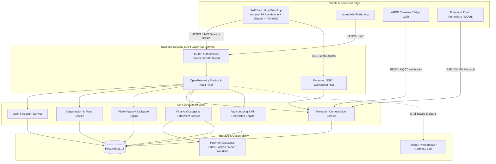

# Requirements

### Overview & Goals
The **Fuel Auto Pay (FAP) Backoffice** is the centralized administrative, operational, financial, and compliance control console for the FAP automated ANPR fueling platform.

The primary objective of FAP Backoffice is to empower platform administrators, forecourt station operators, customer support specialists, financial auditors, and compliance officers to seamlessly monitor, manage, and audit all entities and activities across the FAP ecosystem.

The development approach prioritizes a **drill-down, drill-up, and drill-cross navigation paradigm** starting from a unified **Home Page / Operations Dashboard** that provides immediate operational visibility into users, activities, organizations, and gas stations powered by the FAP system.

---

### Navigation & Information Architecture: Drill-Down, Drill-Up & Drill-Cross Model
The Backoffice architecture enables operators to seamlessly traverse between relational entities without losing context:

```
[Home Page / Dashboard]
   │
   ├── Drill-Down ──► [Gas Station Network] ──► [Station Forecourt] ──► [Pump Controller] ──► [Dispenser / Nozzle]
   │                         ▲                                                │
   │                         │                                                ▼
   ├── Drill-Cross ──► [Organization / Fleet] ───────────────► [Fueling Transaction] ◄─── Drill-Cross
   │                         │                                                ▲                    │
   │                         ▼                                                │                    │
   └── Drill-Down ──► [User / Driver 360] ──► [Vehicle Plate] ──► [ANPR Camera Webhook] ───────────┘
```

- **Drill-Down:** Navigate from high-level summaries to granular details (e.g., Station Network $\to$ Forecourt $\to$ Pump $\to$ Active Transaction $\to$ Raw Dispenser Telemetry; or B2B Organization $\to$ Fleet Sub-accounts $\to$ Driver $\to$ Vehicle Plate).
- **Drill-Up:** Navigate from granular events back to aggregate parents (e.g., from a failed payment transaction up to the Driver Account, Fleet Org, and Station Level summary).
- **Drill-Cross:** Contextual pivoting between interrelated entities (e.g., from an ANPR OCR camera log directly to the matched Vehicle Plate, Driver Profile, assigned Payment Instrument, and active Forecourt Pump session in one click).

---

### Scope

#### In Scope
- **Executive & Forecourt Operations Dashboard:** Unified home page featuring user growth, real-time activity stream, B2B organizations summary, gas station network tree, forecourt pump matrices, and core operational KPIs (dwell time, turnaround time, ANPR accuracy, revenue).
- **User & Customer 360 Management:** B2C drivers, verification states, passkey/WebAuthn credentials, linked social OAuth2 providers, activity timeline, and account lifecycle controls (suspend, lock, reactivate, soft-delete).
- **B2B Organization & Fleet Management:** Corporate profiles (CRN, VAT, billing contact), organizational hierarchies, fleet spending limits, fuel grade permissions, station network whitelists, and consolidated billing/invoicing.
- **Vehicle & License Plate Registry:** Centralized plate database, duplicate plate ownership conflict resolution workflow with document verification, whitelist/blacklist enforcement, and temporary rental fleet mapping.
- **Forecourt & ANPR Real-Time Telemetry:** Live station/pump state matrix (IFSF/DOMS controller integration), ANPR camera webhook ingestion stream with OCR confidence triage, driver mode tracking (Auto-Pay vs Mobile Prompt vs Cash), and emergency pump overrides.
- **Financial Ledger, Reconciliation & Disputes:** Multi-attribute transaction ledger, payment gateway audit (Stripe, Adyen, Nexi, Worldline), pre-authorization vs capture settlement matching, chargeback investigation packs, and partial/full refund execution.
- **Legislation, Privacy & Compliance Hub:** AES-128-CBC PII encryption at rest with justification-gated unmasking and immutable audit logging, GDPR Right-to-be-Forgotten (data purging) and Right-to-Data-Portability (DSAR export), PCI-DSS scoped tokenization, and fiscal VAT breakdown.
- **Observability & Diagnostics:** OpenTelemetry `traceId`/`spanId` correlation and direct deep-linking to Grafana Tempo and Loki logs.

#### Out of Scope
- Direct cashier POS hardware operations (handled by forecourt controllers and station POS terminals).
- Modification of proprietary forecourt dispenser firmware (FAP integrates via standard IFSF/DOMS protocols).
- Raw storage of unencrypted PAN/CVV (handled exclusively via PCI-compliant payment gateway vaults).

---

### User Personas & RBAC Role Matrix

| Role | Target Persona | Key Responsibilities & Access Scope |
|---|---|---|
| **Super Admin** | Platform Lead / System Architect | Full platform configuration, RBAC management, security policies, global integrations. |
| **Operations Support** | Customer Care & Triage Agent | User account triage, Customer 360 timeline, notification resend, stuck pump session release, ticket resolution. |
| **Forecourt Station Manager** | Station Owner / Regional Operator | Live station & pump monitoring, ANPR camera diagnostic stream, local price/grade configuration, forecourt alerts. |
| **Financial Auditor** | Finance & Accounting Specialist | Transaction ledger, payment gateway reconciliations, refund/chargeback processing, VAT & tax reporting. |
| **Compliance & Security Officer** | DPO / Security Engineer | PII access audit review, GDPR deletion/export requests, security log inspection, blacklist management. |

---

### Functional Requirements

#### 1. Home Page / Global Operations Dashboard (Starting Milestone)
- **User Overview Widget:** Real-time KPI cards displaying total registered users, newly verified accounts (24h/7d), active mobile sessions, and verification completion rate.
- **Live Activity Stream:** Real-time chronological event ticker displaying ANPR detections, pump state transitions, driver mode selections, and transaction completions with deep links.
- **Organization & Fleet Overview Widget:** Active corporate accounts, total managed fleet vehicles, fleet budget utilization percentages, and pending corporate onboarding requests.
- **Gas Station Network & Forecourt Overview:**
  - **Organizational Structure Tree:** Multi-tier visual hierarchy (`Station Network / Brand` $\to$ `Regional Cluster / Territory` $\to$ `Station Forecourt` $\to$ `Pump Controller (DOMS/IFSF)` $\to$ `Dispenser / Nozzles / Fuel Grades`).
  - **Forecourt Quick-Status Matrix:** Visual color-coded pump grid showing active states (`IDLE`, `CAMERA_TRIGGERED`, `PRE_AUTH_PENDING`, `DISPENSING`, `SETTLING`, `ERROR`).
  - **Core Forecourt Metrics:** Average forecourt dwell time (entry to exit), average pump turnaround time (nozzle lift to payment capture), ANPR camera OCR accuracy rate (%), fueling throughput (liters/hour), and daily gross volume.

#### 2. User & Customer 360 Management
- **Directory & Multi-Attribute Search:** Instant search across Name, Email, Phone, Plate, Account ID, Org ID, Registration Date, and Account Status.
- **Customer 360 Profile:** Tabbed view displaying personal details, linked OAuth2 accounts (Google, GitHub), registered FIDO2/WebAuthn passkeys (with device label and credential ID), and linked payment card tokens.
- **Unified Activity Timeline:** Chronological stream combining authentication events, ANPR scans, push notifications sent, pump transactions, payment events, and support tickets.
- **Lifecycle Controls:** Suspend/lock accounts, force password resets, unlock brute-force locked accounts, execute soft deletes.

#### 3. B2B Organization & Fleet Management
- **Organization Profiles:** Manage corporate metadata (Legal Name, CRN, VAT, billing contact, registered address).
- **Fleet Hierarchy & Driver Allocation:** Map driver sub-accounts to corporate entities with role permissions (Fleet Manager, Fleet Driver).
- **Policy Enforcement Rules:** Set daily/monthly spending caps per vehicle, restrict allowable fuel grades (e.g., Diesel only), define authorized station geofences, and configure fueling time windows (e.g., Mon–Fri 07:00–19:00).
- **Invoicing & Billing Statements:** Generate aggregated monthly PDF statements, review consolidated payment runs (direct debit, corporate card), and audit fleet tax breakdowns.

#### 4. Vehicle & License Plate Registry
- **Plate Database:** Query registered plates with country code, verification timestamp, linked user/org, and active status.
- **Duplicate Plate Conflict Resolution Workflow:**
  - Dispute queue flagging when a plate is registered by multiple users.
  - Side-by-side inspection of user-submitted vehicle registration documents (V5C / ownership papers).
  - Administrative approval/rejection with automated push/email notifications and seamless ownership re-assignment.
- **Enforcement Lists:** Whitelist VIP/priority emergency fleets; blacklist stolen vehicles, fraud-flagged plates, or chronic payment defaulters.

#### 5. Real-Time Forecourt & ANPR Telemetry
- **Interactive Forecourt Map & Pump Matrix:** Live visual forecourt map displaying real-time pump controller statuses, current flow rate (L/min), dispensed volume, and active nozzle lifts via SSE.
- **ANPR Camera Webhook Stream & OCR Triage:** Live feed of incoming camera webhooks showing raw capture image, OCR confidence score, recognized plate text, camera ID, and matching latency.
- **Driver Mode Visibility:** Real-time visibility into driver selection (Zero-Touch Auto-Pay vs Interactive Mobile Prompt vs Cash/Manual Opt-Out).
- **Forecourt Emergency Overrides:** Manual pump session release, emergency stop/cancel, timeout reset, and drive-away incident flag creation.

#### 6. Financial Ledger, Payment Gateway Reconciliation & Disputes
- **Central Transaction Ledger:** Filterable grid of all fueling transactions with timestamps, station name, pump number, vehicle plate, customer, fuel grade, volume (liters), unit price, discounts, net amount, and payment status (`PRE_AUTHORIZED`, `SETTLED`, `FAILED`, `REFUNDED`).
- **Payment Gateway Audit:** Direct link to payment processor transaction references (Stripe, Adyen, Nexi, Worldline); view pre-auth hold amounts vs final capture settlement amounts.
- **Refund & Chargeback Console:** Execute full or partial refunds with mandatory reason codes; generate dispute packs with camera snapshots and pump controller dispense logs.
- **Automated Settlement Reconciliation:** Daily automated matching of forecourt controller dispense logs (IFSF/DOMS) against payment gateway batch settlements to flag discrepancies.

---

### Operational, Legislative & Regulatory Requirements

#### 1. GDPR & Privacy Legislation
- **PII Encryption at Rest:** Sensitive user fields (`firstName`, `lastName`, `phone`, `email`, `address`, `crn`, `vat`) are encrypted at rest with `AES-128-CBC`.
- **Default Masked Display:** All PII is masked by default in the UI (`j***@example.com`, `+381 64 *** **89`).
- **Audited PII Unmasking:** Viewing plaintext PII requires an explicit administrative justification code (`SUPPORT_TICKET_1234`, `DISPUTE_INVESTIGATION`) which is written to an immutable audit log.
- **Right-to-be-Forgotten (GDPR Erasure):** Cryptographically anonymizes all PII while preserving financial totals for statutory accounting.
- **Right-to-Data-Portability (DSAR):** One-click generation of machine-readable JSON/CSV export of all user-associated data.

#### 2. PCI-DSS Compliance & Scoped Tokenization
- **Zero Raw PAN/CVV Handling:** The Backoffice never receives, processes, or stores raw card data.
- **Vaulted Gateway Tokens:** Backoffice operators only see PCI-compliant masked card identifiers (`•••• 4242`), brand, expiry, and gateway token references.

#### 3. Fiscal & Forecourt Legislation
- **Electronic Dispense Log Matching:** All transactions link directly to immutable IFSF/DOMS fiscal meter readings.
- **VAT & Tax Calculation:** Full compliance with regional VAT rules, displaying gross amount, net amount, applicable VAT rates, and digital receipt delivery receipts.

#### 4. Tamper-Evident Admin Audit Logging & Observability
- **Immutable Audit Trail:** Every backoffice query, state mutation, unmasking, refund, and policy update is recorded with actor ID, timestamp, source IP, previous state, and new state.
- **OpenTelemetry Correlation:** Every error banner, transaction, and audit record embeds `traceId` and `spanId` with one-click deep links to Grafana Tempo and Loki.

# Technical Design

### Architectural Rationale for Angular 19+ (Standalone & Signals)
The decision to build **FAP Backoffice** with **Angular 19+ (Standalone Components and Signals)** is driven by the rigorous demands of an enterprise administrative web console:

1. **High-Density Enterprise Data Grids:**
   - Administrative backoffices require complex tabular views (financial ledgers, audit trails, user directories, plate conflict queues) with multi-column sorting, column reordering, resizable headers, multi-select filtering, cell editing, and high-performance virtual scrolling.
   - Angular pairs seamlessly with battle-tested enterprise UI ecosystems like **PrimeNG 19+ (`p-table`, `p-treeTable`)** to deliver out-of-the-box data grid capabilities with zero custom DOM scaffolding.
2. **Native DOM Ergonomics & Desktop Web Usability:**
   - Unlike canvas-rendered frameworks, Angular renders standard HTML DOM elements. This guarantees native text selection, multi-row copy/pasting into Excel, full accessibility (WCAG / screen readers), standard browser search (`Ctrl+F` / `Cmd+F`), and middle-click multi-tab workflows.
   - Native DOM support ensures password managers (1Password, Bitwarden, Apple Keychain) and WebAuthn / Passkey hardware token authenticators (`navigator.credentials`) work smoothly without custom canvas bridges.
3. **Reactive Real-Time Telemetry with Signals & RxJS:**
   - Angular 19 Signals (`signal()`, `computed()`, `effect()`) provide fine-grained, zone-less reactivity for high-frequency forecourt dashboard updates.
   - Combining Signals with RxJS (`toSignal()`) enables elegant handling of Server-Sent Events (SSE) and WebSocket streams for real-time pump status changes and ANPR camera feeds without unnecessary re-renders.
4. **Strict Architectural Modularity & Dependency Injection:**
   - Angular’s built-in Dependency Injection, functional HTTP interceptors (for JWT refresh and OpenTelemetry `traceparent` injection), and functional route guards (`canActivateFn`, `canMatchFn`) enforce robust RBAC security and clean separation of concerns.
5. **Contract-Driven Development via OpenAPI:**
   - Full TypeScript static typing generated directly from `fap-service` OpenAPI specifications (`/v3/api-docs`) via `@openapitools/openapi-generator-cli` guarantees complete type safety and rapid synchronization.

---

### System Architecture & Data Flow



---

### Key Technical Decisions

1. **Standalone Components & Signal-Based State Architecture:**
   - The application is 100% Standalone (no `NgModule`s).
   - Use Angular 19 Signals for local UI state, query filters, pagination, and modal dialog visibility.
   - Use Signal-based Store services (e.g., `ForecourtStore`, `UserStore`) that expose readonly signals derived from HTTP/SSE streams.

2. **Security & RBAC Guard Implementation:**
   - Authentication via Spring Security OAuth2 Authorization Server with short-lived JWT access tokens (15 min) and automated refresh loops via `HttpInterceptorFn`.
   - Functional route guards (`canActivateChild: [rbacGuard(['SUPER_ADMIN', 'OPERATIONS_SUPPORT'])]`) enforce view-level permissions.
   - UI-level permission directives (`*appHasRole="['FINANCIAL_AUDITOR']"`) conditionally render sensitive actions (e.g., refund buttons, PII unmasking triggers).

3. **PII Decryption & Justification Gate:**
   - Sensitive user fields are rendered via `MaskPiiPipe` by default.
   - Unmasking triggers a reusable `PiiUnmaskDialogComponent` prompting for an audit justification reason.
   - Calls `POST /v1/admin/users/{id}/unmask-pii` with reason payload; backend validates RBAC, decrypts AES-128 ciphertext, and writes an immutable audit record.

4. **Real-Time Telemetry Ingestion (SSE / RxJS / Signals):**
   - `ForecourtStreamService` connects to `/v1/admin/forecourt/stream` using native `EventSource`.
   - Converts SSE event streams to Signals using `toSignal()` with initial fallback states for instant rendering.
   - Automatic reconnection logic with exponential backoff.

5. **Distributed Observability & Trace Deep-Linking:**
   - `TraceparentInterceptor` automatically injects OpenTelemetry headers into all outgoing HTTP calls.
   - Global error handler captures `traceId` from backend `ErrorModel` envelopes and renders clickable badges that deep-link to Grafana Tempo/Loki (`https://monitor.fap.rs/explore?left=...`).

---

### Component & Directory Structure

```
fap-backoffice/
├── src/
│   ├── app/
│   │   ├── core/
│   │   │   ├── api/                   # Auto-generated TypeScript client (OpenAPI)
│   │   │   ├── auth/                  # RBAC guards, WebAuthn MFA, token manager
│   │   │   ├── interceptors/          # Auth bearer, traceparent header, error interceptor
│   │   │   └── services/              # SSE stream manager, theme manager, notification service
│   │   ├── features/
│   │   │   ├── dashboard/             # Home overview: KPI cards, live feed, station matrix
│   │   │   │   ├── components/        # KpiCard, ActivityFeed, ForecourtQuickGrid, OrgSummary
│   │   │   │   └── dashboard.component.ts
│   │   │   ├── users/                 # User directory, Customer 360, Passkey modal
│   │   │   ├── organizations/         # Fleet orgs, policy editor, invoicing statements
│   │   │   ├── plates/                # Plate registry, conflict dispute queue, blacklist
│   │   │   ├── forecourt/             # Live forecourt map, pump state matrix, camera OCR stream
│   │   │   ├── transactions/          # Central financial ledger, payment details, refund dialog
│   │   │   ├── loyalty/               # Tier thresholds, campaign builder, point adjustments
│   │   │   └── audit/                 # Tamper-evident audit logs, GDPR DSAR / purge hub
│   │   ├── shared/
│   │   │   ├── components/            # PiiMaskedText, TraceBadge, StatusBadge, DataGridWrapper
│   │   │   ├── directives/            # HasRoleDirective, AutoFocusDirective
│   │   │   ├── pipes/                 # MaskPiiPipe, FormatLitersPipe, CurrencyFormatPipe
│   │   │   └── models/                # UI state models, breadcrumb models, filter state models
│   │   ├── layout/
│   │   │   ├── header/                # Global search, profile menu, active alerts
│   │   │   ├── sidebar/               # Navigation rail with drill-down routes & badges
│   │   │   └── shell/                 # Admin app shell with breadcrumbs & view router
│   │   ├── app.config.ts              # Standalone app config (providers, routing, http)
│   │   ├── app.routes.ts              # Route definitions with functional RBAC guards
│   │   └── app.component.ts
│   ├── assets/                        # Logos, SVG forecourt icons, i18n JSON files
│   └── styles/                        # Tailwind CSS imports, PrimeNG theme overrides
```

---

### Required Libraries, Components & Best Practices

| Category | Library / Package | Key Components / Features Used | Best Practice Usage in FAP Backoffice |
|---|---|---|---|
| **UI Framework** | `primeng` ^19.0.0 | `p-table`, `p-treeTable`, `p-dialog`, `p-timeline`, `p-chart`, `p-badge`, `p-tag`, `p-toast` | Use `p-table` with `[lazy]="true"` and `[virtualScroll]="true"` for 10k+ transaction records. Use `p-treeTable` for station network hierarchy. |
| **Styling & Icons** | `tailwindcss` ^4.0.0, `primeicons` | Utility classes, SVG icons | Define FAP design tokens (brand colors, surface cards) in Tailwind config; avoid inline styles. |
| **API Client** | `@openapitools/openapi-generator-cli` | `typescript-angular` generator | Run automated generation in `npm run api:generate` against `fap-service` `/v3/api-docs`. |
| **Charts & Metrics**| `chart.js` / PrimeNG Charts | Line, Bar, Doughnut charts | Render forecourt throughput, dwell time trends, and hourly revenue in dashboard widgets. |
| **State & Stream** | `@angular/core` (Signals), `rxjs` | `signal`, `computed`, `effect`, `toSignal`, `toObservable` | Use `toSignal` to bridge SSE event streams; encapsulate feature state in Signal-based services. |
| **Passkey / WebAuthn**| `package:web` / Native JS | `navigator.credentials.get()`, `navigator.credentials.create()` | Native browser WebAuthn API calls for backoffice operator MFA login and hardware passkey setup. |

---

### Administrative REST & SSE API Contracts (in `fap-service`)

| Category | Method | Path | Role | Description |
|---|---|---|---|---|
| **Dashboard** | `GET` | `/v1/admin/dashboard/summary` | `OPERATIONS_SUPPORT` | Aggregated user, fleet, and forecourt KPIs |
| **Dashboard** | `GET` | `/v1/admin/dashboard/activity-stream`| `OPERATIONS_SUPPORT` | SSE stream for real-time forecourt activity ticker |
| **Users** | `GET` | `/v1/admin/users` | `OPERATIONS_SUPPORT` | Paginated search of users with filter criteria |
| **Users** | `GET` | `/v1/admin/users/{id}/360` | `OPERATIONS_SUPPORT` | Customer 360 timeline, linked passkeys & devices |
| **Users** | `POST` | `/v1/admin/users/{id}/unmask-pii` | `OPERATIONS_SUPPORT` | Request decrypted PII with audit justification |
| **Users** | `POST` | `/v1/admin/users/{id}/status` | `OPERATIONS_SUPPORT` | Update account status (Lock, Suspend, Reactivate) |
| **Fleet** | `GET` | `/v1/admin/organizations` | `OPERATIONS_SUPPORT` | List B2B organizations & fleets |
| **Fleet** | `GET` | `/v1/admin/organizations/{id}/hierarchy`| `OPERATIONS_SUPPORT` | Organization tree with sub-accounts & vehicles |
| **Fleet** | `PUT` | `/v1/admin/organizations/{id}/policies` | `OPERATIONS_SUPPORT` | Update fleet fueling limits & restrictions |
| **Plates** | `GET` | `/v1/admin/plates/conflicts` | `OPERATIONS_SUPPORT` | List plate ownership dispute queue |
| **Plates** | `POST` | `/v1/admin/plates/{plateId}/resolve-conflict`| `OPERATIONS_SUPPORT` | Assign verified plate ownership with audit note |
| **Plates** | `POST` | `/v1/admin/plates/blacklist` | `COMPLIANCE_OFFICER` | Add plate to blacklist with reason |
| **Forecourt** | `GET` | `/v1/admin/forecourt/stations` | `STATION_MANAGER` | Station network hierarchy & pump status matrix |
| **Forecourt** | `GET` | `/v1/admin/forecourt/stream` | `STATION_MANAGER` | SSE stream for live pump states & camera OCR events |
| **Forecourt** | `POST`| `/v1/admin/forecourt/pumps/{pumpId}/override`| `STATION_MANAGER` | Emergency pump override / release / abort |
| **Finance** | `GET` | `/v1/admin/transactions` | `FINANCIAL_AUDITOR` | Paginated transaction ledger with filters |
| **Finance** | `POST`| `/v1/admin/transactions/{id}/refund` | `FINANCIAL_AUDITOR` | Process full/partial refund |
| **Finance** | `GET` | `/v1/admin/finance/reconciliation` | `FINANCIAL_AUDITOR` | Daily controller dispense vs settlement reconciliation |
| **Audit** | `GET` | `/v1/admin/audit/logs` | `COMPLIANCE_OFFICER` | Immutable administrative audit log trail |
| **GDPR** | `POST`| `/v1/admin/gdpr/export/{userId}` | `COMPLIANCE_OFFICER` | Generate machine-readable DSAR data export |
| **GDPR** | `POST`| `/v1/admin/gdpr/purge/{userId}` | `SUPER_ADMIN` | Irrevocable PII anonymization / purge |

# Testing

### Validation Approach
Verification of the FAP Backoffice follows a rigorous multi-tier testing strategy:
- **Unit & Component Testing:** Jasmine/Karma or Vitest testing for Standalone components, Signal stores, `MaskPiiPipe`, and functional RBAC route guards.
- **Integration Testing:** Mocked HTTP interceptor tests validating OpenTelemetry `traceparent` header propagation, automatic 401 token refresh loops, and OpenAPI DTO serialization.
- **End-to-End Operational Simulations (Playwright):** Full browser E2E tests validating drill-down/drill-cross navigation, real-time SSE stream ingestion, PII unmasking justification prompts, and refund execution workflows.
- **Security & Compliance Audits:** Automated RBAC privilege escalation tests and GDPR anonymization verification.

---

### Key Scenarios

#### 1. Home Page / Dashboard & Navigation Scenarios
- **Scenario 1.1: Dashboard KPI & Live Activity Stream Ingestion**
  - Verify dashboard loads aggregate KPI counters (Users, Organizations, Forecourt Throughput).
  - Inject simulated SSE forecourt events (`CAMERA_TRIGGERED`, `DISPENSING`, `SETTLED`).
  - Verify the live activity feed dynamically updates without full-page re-renders.
- **Scenario 1.2: Drill-Down & Drill-Cross Navigation**
  - From the Dashboard Gas Station matrix, click a specific pump in `ERROR` status $\to$ drill down to Forecourt Pump Inspector.
  - From the failed transaction on that pump, drill cross to the Driver Account 360 profile.
  - From the Driver Profile, drill cross to the linked B2B Organization and vehicle fleet.
  - Verify browser URL query parameters and breadcrumbs reflect the exact navigation state.

#### 2. User & Account Management Scenarios
- **Scenario 2.1: PII Masking & Audited Unmasking Flow**
  - Verify user list displays masked email (`j***@example.com`) and masked phone number.
  - Click "Unmask PII" $\to$ verify justification dialog appears.
  - Submit justification reason `"Investigating transaction dispute #9841"`.
  - Verify plaintext PII is displayed and an immutable record is logged in the Audit module with operator ID and reason code.
- **Scenario 2.2: Account Suspension & WebAuthn Token Revocation**
  - Administrator suspends a compromised driver account.
  - Verify driver's active JWT is invalidated in `fap-service` and subsequent mobile requests return 401.

#### 3. License Plate Dispute & Fleet Policy Scenarios
- **Scenario 3.1: Duplicate Plate Conflict Resolution**
  - Navigate to Plate Conflict Queue with two competing driver claims.
  - Review uploaded vehicle registration certificate (V5C) preview.
  - Approve ownership for Driver B $\to$ verify Driver A's plate is revoked with an automated push notification dispatched.
- **Scenario 3.2: Fleet Spending Policy Enforcement**
  - Configure a €150/day fleet vehicle limit in the Organization Policy Editor.
  - Verify transactions exceeding the limit are flagged and rejected during pre-authorization.

#### 4. Real-Time Forecourt Telemetry & Emergency Overrides
- **Scenario 4.1: Live Pump State Matrix Transitions**
  - Simulate a fueling cycle: Camera OCR hit $\to$ `CAMERA_TRIGGERED` $\to$ Pre-auth hold $\to$ `PRE_AUTH_PENDING` $\to$ Nozzle lift $\to$ `DISPENSING` $\to$ Nozzle hangup $\to$ `SETTLING` $\to$ `IDLE`.
  - Verify UI pump card colors and telemetry gauges reflect state changes within $<200\text{ ms}$.
- **Scenario 4.2: Stuck Session Emergency Override**
  - Operator clicks "Emergency Abort & Release Pump" on a hung dispenser.
  - Verify backend releases pump controller lock, cancels pre-auth payment hold, and logs the action in the audit ledger.

#### 5. Financial Ledger & Settlement Reconciliation
- **Scenario 5.1: Transaction Ledger Filtering & Partial Refund**
  - Search ledger by Plate `BG-123-AA` and Date Range.
  - Open transaction detail $\to$ execute a partial refund of €15.00 for fuel dispensing discrepancy.
  - Verify Stripe/Adyen refund API is invoked, status updates to `PARTIALLY_REFUNDED`, and audit log is created.
- **Scenario 5.2: Daily Settlement Batch Mismatch Alert**
  - Simulate a discrepancy between IFSF pump dispense total (€25,000) and payment gateway settlement batch (€24,850).
  - Verify reconciliation report flags the €150 variance and identifies the unsettled transaction.

---

### Security & Legislation Verification
- **RBAC Guard Escalation Prevention:** Verify an operator with `OPERATIONS_SUPPORT` role cannot invoke refund endpoints or access GDPR purge actions.
- **GDPR Anonymization Verification:** Verify that executing a GDPR purge replaces user PII with cryptographic hashes while preserving historical transaction amounts for VAT reporting.
- **OpenTelemetry Deep-Linking:** Verify clicking a `traceId` badge opens Grafana Tempo with the pre-populated trace query.

# Delivery Steps

###   Step 1: Implement Core RBAC, Backoffice Auth & Admin Audit Logging Framework
Establish secure administrative authentication, role-based permission gates, and tamper-evident audit logging for all operator actions.

- Scaffold Angular 19+ standalone application with PrimeNG 19+, Tailwind CSS, and PrimeIcons.
- Configure OpenAPI client code generation (`@openapitools/openapi-generator-cli`) against `fap-service` `/v3/api-docs`.
- Implement administrative authentication with OAuth2 JWT bearer tokens, automated token refresh interceptor, and WebAuthn / Passkey MFA support.
- Implement functional RBAC route guards (`canActivateFn`, `canMatchFn`) and `*appHasRole` structural directives for `SUPER_ADMIN`, `OPERATIONS_SUPPORT`, `STATION_MANAGER`, `FINANCIAL_AUDITOR`, and `COMPLIANCE_OFFICER`.
- Build the `MaskPiiPipe`, `PiiUnmaskDialogComponent`, and immutable audit log engine with mandatory "Reason for Access" prompt.
- Implement OpenTelemetry header propagation (`traceparent`) and clickable `TraceBadgeComponent` deep-linking to Grafana Tempo/Loki.

###   Step 2: Build Home Page / Operations Dashboard with Users, Organizations, Activities & Gas Station Forecourt Matrix
Provide platform operators with instant visibility into platform metrics, real-time forecourt activity, and gas station network hierarchies.

- Build the Home Page / Dashboard layout with responsive KPI metric cards (Users, Active Sessions, Fleet Vehicles, Gross Volume).
- Implement the Real-time Live Activity Feed via Server-Sent Events (`ForecourtStreamService` + `toSignal`) displaying chronological forecourt events.
- Build the Gas Station Network Organizational Hierarchy tree view (`Station Network / Brand` $\to$ `Regional Cluster` $\to$ `Station Forecourt` $\to$ `Pump Controller` $\to$ `Dispenser / Fuel Grades`).
- Build the Forecourt Quick-Status Matrix displaying real-time color-coded pump states and operational metrics (dwell time, turnaround time, ANPR OCR accuracy).
- Build the B2B Organization Summary widget displaying active corporate accounts and fleet budget utilization.

###   Step 3: Implement User 360 & B2B Organization Fleet Management with Drill-Cross Navigation
Enable support agents and fleet managers to inspect and manage individual drivers and corporate fleet organizations.

- Implement advanced User Directory search and filtering (Name, Email, Phone, Plate, Account ID, Org ID, Registration Date, Verification Status).
- Build the User Customer 360 Profile with tabs for personal data (PII unmasking on demand), authentication history, linked social OAuth2 providers, registered passkeys/devices, and lifecycle controls (suspend, lock, reactivate, force password reset).
- Build B2B Organization & Fleet Management views: corporate profiles (CRN, VAT, billing contact), linked sub-accounts/drivers, and consolidated monthly PDF billing statements.
- Implement the Fleet Policy Editor: vehicle-driver assignment, fuel grade allowances, daily/monthly spending caps, and allowable station networks / fueling time windows.
- Wire contextual drill-cross navigation links between Users, Organizations, Vehicles, and Transactions.

###   Step 4: Implement License Plate Registry, Conflict Resolution Queue & Enforcement Lists
Operators can manage the centralized vehicle plate registry, resolve duplicate plate conflicts, and maintain enforcement lists.

- Build the Plate Registry Search and Detail interface: plate number, country code, owner account, registration date, and verification status.
- Implement the Plate Ownership Conflict Resolution workflow: dispute queue flagging, side-by-side inspection of uploaded vehicle registration documents (V5C / ownership proof), administrative re-assignment, and automated user notifications.
- Create Whitelist and Blacklist management: blocking stolen or flagged vehicles, enforcing payment default holds, and whitelisting VIP fleets for priority forecourt fueling.
- Implement plate alias and temporary plate assignment for rental fleets and commercial loaner vehicles.

###   Step 5: Implement Real-Time Forecourt Telemetry, ANPR Ingestion & Emergency Controls
Provide forecourt operators with live visibility into forecourt operations, camera ANPR webhooks, pump controllers, and active driver sessions.

- Implement the real-time Forecourt Live Dashboard via WebSocket/SSE streaming: station status, pump statuses (Idle, Authorizing, Fueling, Settling, Error), flow rate gauges, and active nozzle lifts.
- Build the ANPR Camera Ingestion Stream & Diagnostics tool: view real-time camera webhooks, OCR confidence scores, raw plate capture snapshots vs OCR text, and misread triage queue.
- Build the Driver Fueling Mode & Session Monitor: track session progression across Zero-Touch Auto-Pay, In-App Push Prompt confirmation, and Cash/Manual Opt-out.
- Implement Forecourt Emergency & Override Controls: manual pump session release, emergency stop/cancel, timeout reset, and drive-away incident flag creation.

###   Step 6: Implement Financial Ledger, Payment Gateway Settlement Reconciliation & Legislation Compliance Hub
Financial auditors and compliance officers can audit forecourt transactions, reconcile payment gateway settlements, and enforce legal/statutory compliance.

- Build the Central Transaction Ledger: filterable by transaction ID, station, pump, vehicle plate, customer, fuel grade, payment gateway, settlement status, and date range.
- Implement Transaction Detail Inspection: breakdown of fuel volume (liters), unit price, gross total, loyalty discounts applied, net charged amount, VAT calculation, and digital receipt delivery logs.
- Integrate Payment Gateway Management: view vaulted payment card tokens (PCI-compliant masked PAN, expiry, brand, gateway token reference) without exposing raw PAN/CVV.
- Implement Refund & Dispute Console: execute partial/full refunds with mandatory reason codes; generate dispute packs with camera snapshots and pump controller dispense logs.
- Implement Financial Settlement Reconciliation: daily matching of forecourt controller dispense logs (IFSF/DOMS) against payment gateway batch settlements (Stripe, Adyen, Nexi, Worldline).
- Implement GDPR Compliance Hub: execute Right-to-be-Forgotten (data anonymization/purging) and Right-to-Data-Portability (DSAR JSON/CSV export) requests with immutable audit logging.